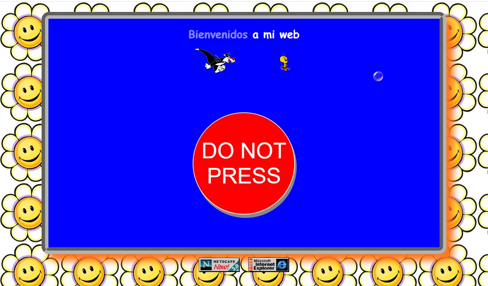
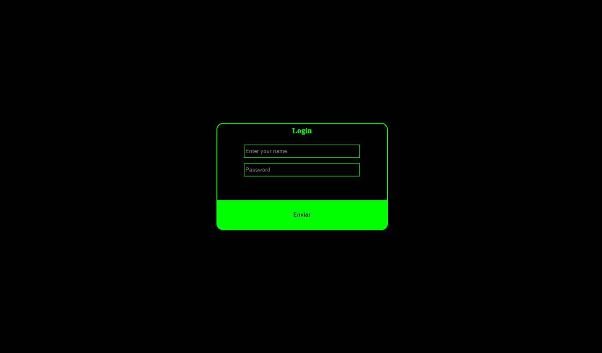
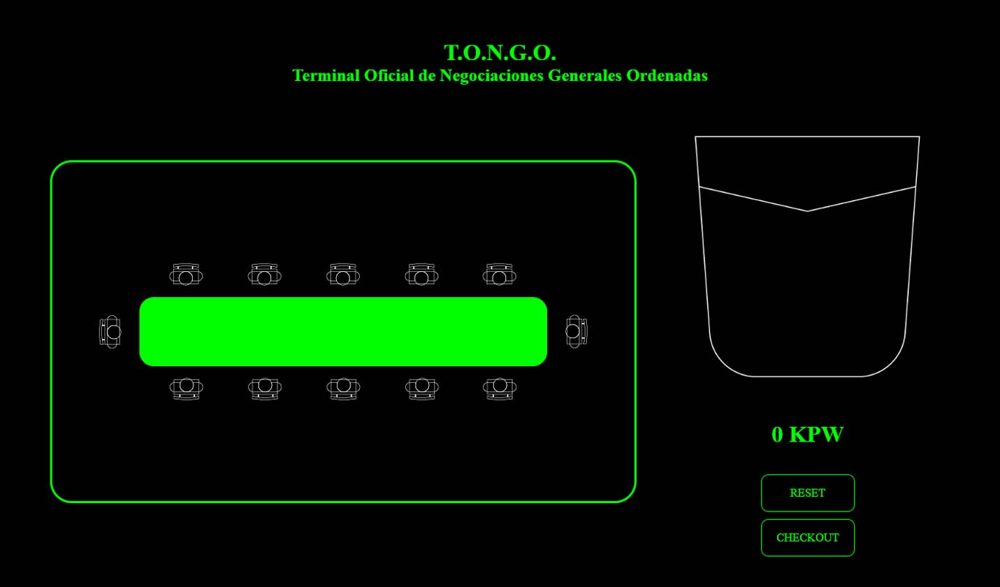
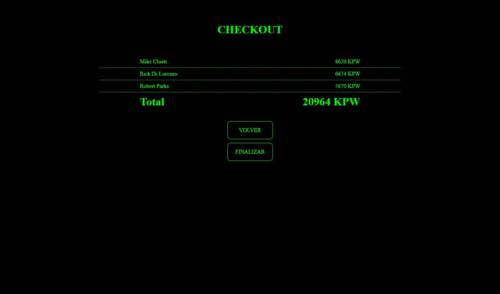

# Urbalab bootcamp proyecto 3
## Showdown dinámico
### David Delgado

Se trata de una web en la que a través de drag & drop se añaden items al carrito

## Características generales

El proyecto está desarrollado en HTML, CSS y vanilla JavaScript.
Este proyecto se inició el dia 19 de septiembre, y se termina el dia 29 de septiembre.

## Resúmen

El proyecto simula une SPA (single page application) hecha con un framweork tipo Angular, React...
La web se llama Terminal Oficial de Negociaciones Generales Ordenadas (T.O.N.G.O)
Habrá un portal web tipo años 90 como "distracción". 
La web se inicia con un formulario de acceso al TONGO
Se simula una página de carga simulando el acceso a un backend.
Se puede comprar diferentes cargos políticos y añadirlos al carrito de compra 
Los datos se almacenarán en localstore.
Si se recargara la página, se mantienen los datos y se accede a la aplicación principal directamente.
Una vez realizado el checkout, el sitio volverá a la página de inicio.

## Inicio


Se simula una web tipo años 90, y el acceso al backend se hace buscando un acceso "escondido", como método de distracción.

## Login

Formulario de acceso a la aplicación.
En este caso no conecta con ningun backend, únicamente es algo estético.


## Aplicación principal

A la izquierda están los "candidatos" para la compra. Estos se han de arrastrar al bolsillo de la parte derecha para añadirlos al "carrito".
Una vez añadido al bolsillo, este elemento es eliminado y no vuelve a estar disponible para la compra.
Debajo del bolsillo, está indicado el total al que asciende la compra.
Boton RESET: resetea la compra, a la vez que vuelve a generar todos los elementos para la compra. El precio de compra de cada elemento es aleatorio.



## Checkout

Representación visual de los itmes añadidos al bolsillo de compra, con el precio de compra.
Botón VOLVER: vuelve a la página de la aplicación, manteniendo los items ya adquiridos.
Botón FINALIZAR: finaliza la compra y vuelve al inicio.




## Recogida de datos desde la API

Los datos se recogen desde: https://represent.opennorth.ca/representatives 

La llamada a la API se hace desde la función asíncrona


```
const fetchItems = async () => {
    let res = await fetch(url)
    let data = await(res.json())
    itemArray = data.objects
    .sort((a, b) => 0.5 - Math.random())
    .map((item, index )=> {
      let precio = Math.floor(Math.random() * (10000 - 3000 + 1) + 3000)
      return ({
        id: "itemCompra"+index,
        nombre: item.name,
        cargo: item.elected_office,
        precio,
        disponible: true
      })
    });   
    localStorage.setItem("itemArray", JSON.stringify(itemArray));
    
  cargarAplicacion();
}
````

Una vez recibidos los datos, se ordenan aleatoriamente
```
.sort((a, b) => 0.5 - Math.random())
```
y a acontinuación se mapea un array para cada objeto y se le asigna un precio aleatorio

```

let precio = Math.floor(Math.random() * (10000 - 3000 + 1) + 3000)
````

Por último se alamacena esta nueva array en localStorage
```
localStorage.setItem("itemArray", JSON.stringify(itemArray));
```

y se ejecuta la aplicación

```
cargarAplicacion();
```


Los nombres y los cargos son reales, y únicamente se utilizan en esta aplicación a modo demostrativo. En nigún caso se puede inferir ningún tipo de comportamiento fraudulento por parte de cualquiera de los nombres que se hayan mostrado en pantalla.


## Tiempo de ejecución

Para controlar el tiempo de ejecución de la aplicación, se almacena el código en diferentes funciones, que se van ejecutando según la aplicación va necesitando de ellas. 


## Modularidad

Cada página cuenta con su propio archivo javascript y css, con el fin de mantener el código limpio y ordenado.
También la funcionalidad de recogida y almacenamiento de datos se hace desde su propio archivo para mantener separado el estado de la aplicación de la estructura.

## Implementaciones futuras:

- Añadir la funcionalidad de login y conectarlo con un backend para autentificar usuarios
- Almacenar los datos en una base de datos externa para poder editar o eliminar elementos.


